# Ansible FragDenStaat.de

Based on [ansible-django-stack](https://github.com/jcalazan/ansible-django-stack).

Ansible to deploy FragDenStaat.de - a Django app with Postgres database, ElasticSearch search engine, Celery+RabbitMQ background queue, Redis server and a full email server with postfix and dovecot on Ubuntu 22.04.


## Install this repo

```bash
python -m venv ansible-env
source ansible-env/bin/activate
pip install -r requirements.txt
```

## Configure your SSH user

Copy `local_vars/local_config.yml.example` to `local_vars/local_config.yml` and set your SSH username.

## Deploy FragDenStaat.de

Run this to deploy FragDenStaat.de

    ansible-playbook playbooks/fragdenstaat.de.yml -v

There are tags available:

- `deploy-web` – updates app and reloads app server
- `deploy-backend` – like `deploy-web` but also restarts workers
- `deploy-frontend` - rebuilds frontend and reloads app server
- `nginx` – rebuilds nginx config and reload nginx

Use like this:

```
ansible-playbook playbooks/fragdenstaat.de.yml -v -t deploy-web -t deploy-frontend
```

## Secrets management

Secrets are managed with `ansible-vault`.

Edit production secrets:

```
ansible-vault edit group_vars/all/secrets.yml
```

## Add VPN clients

Make sure vpn server is setup.

Setup VPN server:
```
ansible-playbook -v playbooks/vpnserver.yml
```

Store public key in host variables file in `host_vars/` under the key `host_data.wg_publickey`

Run this script to add a client:

```
ansible-playbook -v playbooks/extra/vpn_add_client.yml
```

The playbook will ask for the client name and a (python) list of allowed endpoints. The endpoint names must match the server names in the `inventory`. If no endpoints are given, access will be granted to all of them.

After it's done, a client configuration file is in your local directory and the public key has been recorded in encrypted form `env_vars/vpnclients.yml`.
You should commit `env_vars/vpnclients.yml`.

Update the peers on the server:

```
ansible-playbook -v playbooks/vpnserver.yml
```


## Current FragDenStaat.de architecture

```mermaid
flowchart TB
    subgraph brooke
        brookessh[[SSH access]]
        appserver[Gunicorn/Uvicorn]
        brookenginx[nginx frontend server]
        appworker[Celery Worker]
        wireguard[Wireguard VPN]
        db[Postgres Database]
        postfix["Postfix (SMTP)"]
        dovecot["Dovecot (IMAP)"]
        redis[Redis Broker]
        memcached[memcached Cache]
        rabbitmq[RabbitMQ Queue]
        brookessd[(SSD storage)]
    end
    subgraph brooke
        brookenginx-->appserver
        brookenginx-->brookessd
        appserver-->db
        nfsmount-- media files -->nfs
        appserver-->nfsmount
        appserver-->rabbitmq
        appserver-->memcached
        appserver-- mail download -->dovecot
        appserver-- Websocket Channel Layer Group -->redis
        rabbitmq<-->appworker
        postfix-- check deliverability -->db
        db-->brookessd
        postfix-->brookessd
        dovecot-->brookessd

        appworker-->db
        appworker-->nfsmount
        appworker-- fetch mail -->dovecot
        appworker-- Mail Log reading -->brookessd

        wireguard-->brookenginx

        brooke-cronbackup[Cron Backup Task]
        brookessd-- mail storage --> brooke-cronbackup
        brookessd-- database dumps --> brooke-cronbackup
        nfsmount

        brooke-graylog-sidecar[[graylog sidecar]]
        brooke-prometheus-exporter[[prometheus exporter]]
    end

    subgraph schoch
        schochssh[[SSH access]]
        schochnginx[nginx frontend server]
        schochnginx--authenticating access --> appserver
        schochnginx-->schochhdd[(HDD storage)]
        nfs<-->schochhdd[(HDD storage)]-->schoch-cronbackup[Cron Backup Task]
        schoch-graylog-sidecar[[graylog sidecar]]
        schoch-prometheus-exporter[[prometheus exporter]]
    end

    subgraph schaar
        schaarssh[[SSH access]]
        fdsbot[Slack fdsbot]
        schaarnginx
        db-->dbreplica[Postgres Database Replica]
        schaar-graylog-sidecar[[graylog sidecar]]
        schaar-prometheus-exporter[[prometheus exporter]]
        docker-->schaar-cronbackup[Cron Backup Task]
    end
    subgraph schaar
        schaarnginx[nginx frontend server]
        subgraph docker
            schaarnginx-->weblate
            schaarnginx-->fds-forum
            schaarnginx-->fds-ogimage
            schaarnginx-->metabase
        end
        metabase-- reporting schema views -->db
    end

    subgraph fds-es1
        fdses01ssh[[SSH access]]
        elasticsearch[Elasticsearch server]<-->appworker
        elasticsearch-->fdses01ssd[(SSD storage)]
        fds-es1-graylog-sidecar[[graylog sidecar]]
        fds-es1-prometheus-exporter[[prometheus exporter]]
    end

    subgraph internet
        slack([Slack])==>fdsbot-->brookessh
        user([User])== media.frag-den-staat.de ==>schochnginx
        user== fragdenstaat.de / static.frag-den-staat.de ==>brookenginx
        user== ogimage.frag-den-staat.de ==>schaarnginx
        mailuser([Email])==>postfix
        fdsstaff([FDS staff])==>dovecot
        fdsstaff==>schaarnginx
        fdsstaff==>wireguard
    end

    subgraph backupstorage
        backup[(backup storage)]
        brooke-cronbackup-->backup
        schoch-cronbackup-->backup
        schaar-cronbackup-->backup
    end

    subgraph fds-tst
        fdsstaff==>fds-tstwireguard[Wireguard VPN]-->fds-tstnginx[nginx reverse proxy]
        fdsstaff==>fds-tstmail[SMTP proxy]
    end
    subgraph fds-tst
        subgraph fds-tstvm[VMs]
            fds-tstmail-->brooke-tst
            fds-tstnginx-->brooke-tst
            fds-tstnginx-->schaar-tst
            fds-tstnginx-->schoch-tst
            fds-tstnginx-->fds-es01-tst
        end
    end

    subgraph fds-mon
        fdsstaff==>fds-monwireguard-->fds-monnginx
        fds-monwireguard[Wireguard VPN]
        fds-monnginx[Nginx reverse proxy]
    end
    subgraph fds-mon
        subgraph fds-mondocker[docker]
            fds-monnginx-->sentry
            fds-monnginx-->grafana
            fds-monnginx-->graylog
            fds-monnginx-->prometheus
        end
    end
```


